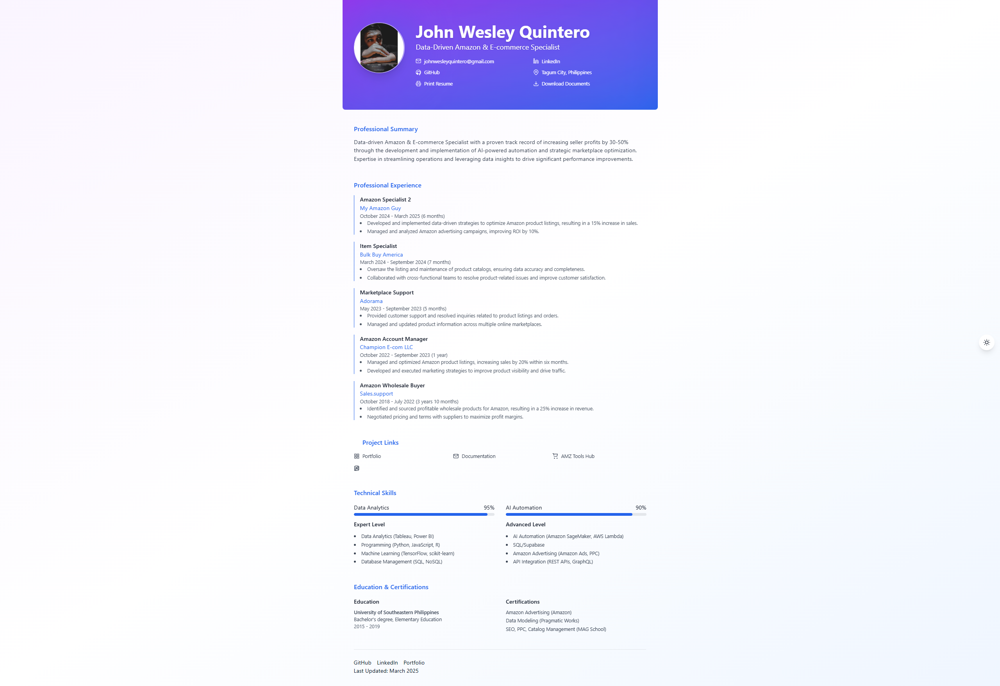

# Wesley Quintero - Professional Resume

## 📝 Project Overview
This repository hosts my professional resume and portfolio materials, designed to showcase my expertise as an Amazon Specialist with SEO, PPC, Inventory Management, and Account Health skills.

## ✨ Key Features
- **Fully Responsive** - Adapts seamlessly to all device sizes
- **Professional Design** - Clean layout optimized for recruiters and hiring managers
- **Specialized Sections** - Highlights Amazon-specific expertise areas
- **Easy Customization** - Simple to update with your personal information
- **PDF Export** - Built-in functionality to generate printable versions

## 🚀 Quick Start

### Prerequisites
- Web browser (Chrome, Firefox, or Edge recommended)
- [Git](https://git-scm.com/) (for version control)
- GitHub account (optional for forking)

### Installation
```bash
git clone https://github.com/johnwesleyquintero/resume/resume.git
cd resume
```

## 💻 Development
To run locally:
```
python -m http.server
```


## 🎯 Demo
[](https://johnwesleyquintero-resume.netlify.app)  
[](https://github.com/johnwesleyquintero/resume/)

## 🛠 Customization
To personalize this resume template:

1. Edit `index.html` - Update content and structure
2. Modify CSS - Adjust styling in `styles.css`
3. Add documents - Place PDFs in the `docs/` folder

## 🌐 Deployment
This template comes pre-configured for:
- [Netlify](https://www.netlify.com/) - Connect your GitHub repository for automatic deploys
- GitHub Pages - Simple static hosting via GitHub

## 🤝 Contributing
While this is primarily a personal resume, constructive feedback is welcome:
1. Fork the repository
2. Create your feature branch (`git checkout -b feature/improvement`)
3. Commit your changes (`git commit -m 'Add some improvement'`)
4. Push to the branch (`git push origin feature/improvement`)
5. Open a Pull Request

## 📜 License
Distributed under the MIT License. See [LICENSE.md](LICENSE.md) for more information.

## 📞 Contact
For professional inquiries:  
## 🛠️ Built With
- HTML5 & CSS3
- JavaScript (for interactive elements)
- [Lucide Icons](https://lucide.dev/)
- Netlify (for deployment)

For professional inquiries:  
📧 wesley.ecomva@gmail.com  
🔗 [LinkedIn](https://www.linkedin.com/in/johnwesleyquintero/)  
🐦 [Portfolio](https://johnwesleyquintero.vercel.app/)  
🐙 [GitHub](https://github.com/johnwesleyquintero)  
## 📸 Screenshot


